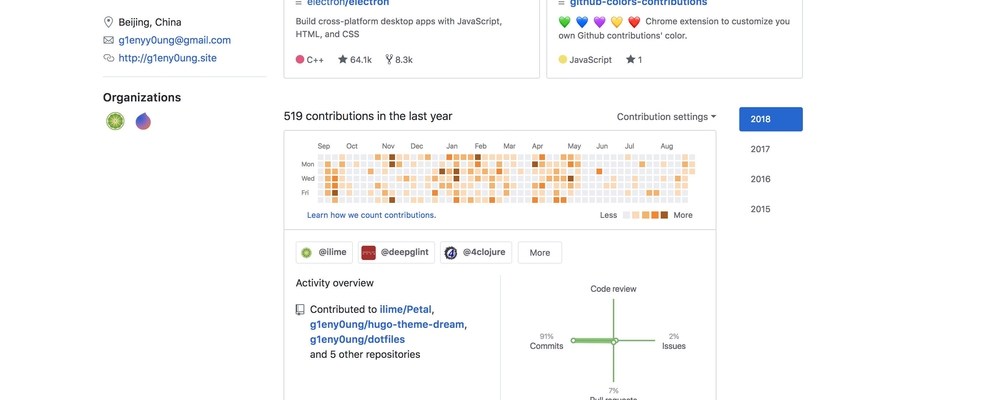

# github-colors-contributions

:green_heart: :blue_heart: :purple_heart: :yellow_heart: :heart: Chrome extension to customize you own Github contributions' color.

## Screenshot



## How To Use

```sh
chmod +x bundle.sh
./bundle.sh
```

Then unpack the `g-c-c.zip` and load `bundle/` in [chrome://extensions/](chrome://extensions/).

## License

Copyright © 2018 g1eny0ung

Distributed under the Eclipse Public License either version 1.0 or (at your option) any later version.
